<div align="center">


<br />

<a href="https://github.com/dakwol?tab=repositories">
  
</a>
<a href="mailto:daniilfomenko99@gmail.com">
  
</a>

</div>

<br />

## Инженерный профиль

Я проектирую и развиваю сложные frontend-системы: от архитектуры больших React-приложений до высоконагруженной 3D-визуализации, GIS-интерфейсов, WebRTC и потоков данных в реальном времени.

Как **Frontend Tech Lead**, я отвечаю не только за реализацию интерфейса, но и за технические границы системы, декомпозицию, производительность, инженерные стандарты и развитие команды.



<br />



## Технологический фокус

| Платформа и архитектура | 3D и GIS | Real-time и медиа | Качество и производительность |
|---|---|---|---|
| TypeScript, React, Next.js | Three.js, WebGL | WebRTC, WHEP, HLS | Chrome DevTools |
| Feature-Sliced Design | MapLibre GL | SignalR, WebSocket | CPU/GPU profiling |
| Effector, URQL | GeoJSON, terrain | Live telemetry | Heap snapshots |
| React Hook Form, Zod | Custom 3D layers | Синхронизация видео | LOD, culling, batching |

## Как я принимаю технические решения

```typescript
enum EngineeringPriority {
  Correctness = 'correctness',
  Maintainability = 'maintainability',
  Performance = 'performance',
  Delivery = 'delivery',
}

interface EngineeringDecision {
  problem: string;
  constraints: string[];
  priorities: EngineeringPriority[];
  measurableResult: string;
}
```

Архитектура должна сохранять понятность при росте команды, продукта и объёма данных. Производительность должна проектироваться заранее, а не добавляться как исправление в конце разработки.


### Избранные репозитории

- **[Prizma](https://github.com/dakwol/prizma)** — архитектурная модель цифрового мира и его представлений.
- **[GeoSight](https://github.com/dakwol/geosight)** — геопространственный frontend-проект.
- **[Finance Tracker Web](https://github.com/dakwol/Finance-Tracker-Web)** — финансовое пространство на Next.js с Google Sheets и Google Drive API.
- **[Indicator](https://github.com/dakwol/indicator)** — развитие интерфейсных и архитектурных решений.


## СБОРКА

**СБОРКА** — формирующаяся инженерная команда для создания собственных продуктов.

Основной принцип команды: строить не набор экранов, а цельные системы с ясной архитектурой, измеримой производительностью и возможностью долгосрочного развития.

Сферы интереса команды:

- сложные веб-платформы;
- 3D и геопространственные интерфейсы;
- real-time приложения;
- инструменты для разработчиков;
- собственные цифровые продукты.

## Сейчас в фокусе

- развитие **Prizma** как архитектурной основы цифровых миров;
- GPU-ориентированная browser-графика;
- эффективная визуализация больших объёмов динамических объектов;
- AI-инструменты для инженерных процессов;
- подготовка команды **СБОРКА** к работе над собственными продуктами.

<div align="center">


<br />


</div>
